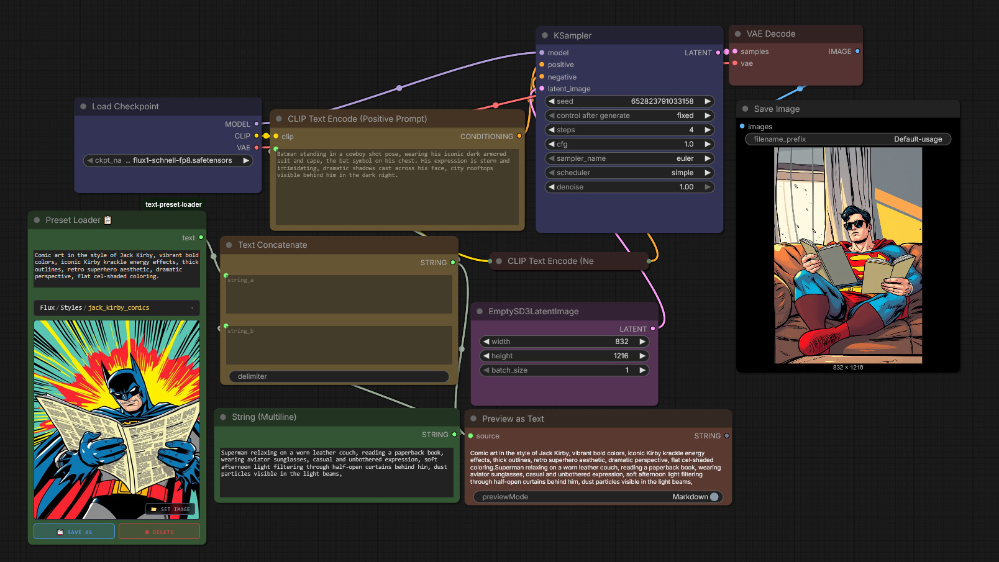
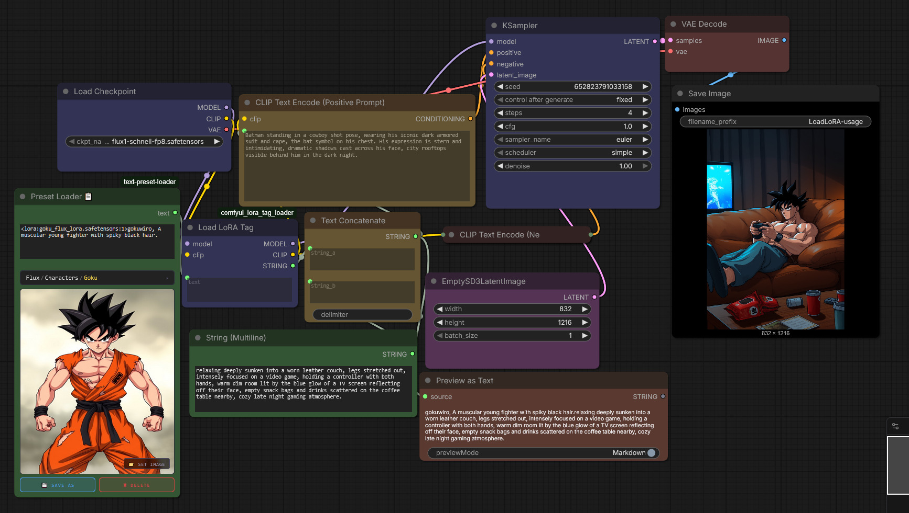

# ComfyUI text preset loader

while using comfyui I found my self switching between group of texts either for my favourite art styles or characters.

## Features
- Load text presets from JSON
- Switch between different text presets
- Edit and save new text presets
- optional preview image for each preset
- Tree structure for presets to organize them in categories and subcategories
- search function to quickly find presets by name

## Usage
1. load Preset Loader Node from Node library
2. in the drop-down menu choose between your text presets
3. the text preset will be loaded in the string box and the image will be shown in the image box if it exists
4. you can edit the text in the string box and save it as a new preset by clicking the save button and giving it a name.
5. the new preset will be added to the drop-down menu and can be loaded like the other presets.
6. you can also delete presets by clicking the delete button on the node.
7. you can save preview image for the preset by clicking the save image button and selecting an image file.

## usage in workflow
1. connect the output of the Preset Loader Node to the input of a Text concatenate Node.
2. use the other input of the Text concatenate Node to add any additional text you want to include in your prompt.
3. connect the output of the Text concatenate Node as text for CLIP text encode node.
4. use the output of the CLIP text encode node as usual.

## examples 
### default usage with comfy core.

### advanced usage to load LoRA using [comfyui_lora_tag_loader](https://github.com/badjeff/comfyui_lora_tag_loader) by badjeff

## Notes
- tested it a little bit with nodes 2.0 seems to work. but it was designed for classic.
- I have allergy for JS, so I am sorry if there is something not accounted for.
- To save new preset rather than overwrite just change the name after hitting the save as button.
- remember to use / to create categories and subcategories in the preset name.
- the node comes with 7 presets for testing in flux, you can delete them if you want or edit them as you like.

## acknowledgements
- Claude Sonnet 4.6 from Anthropic.
